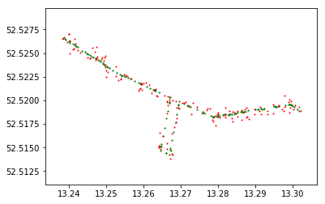

# locintel

<b>loc</b>ation <b>intel</b>ligence focuses on easy and efficient map, routing and GPS/trace data collection, processing, analysis and learning.

## Featured modules

### datamodel

Unambiguous abstractions for location intelligence entities + converters. 

Avoid implementing boilerplate geospatial classes such as `GeoPoint`, `Point` or `Route` (and conversions to/from popular formats like GeoJson) across your organziation's codebase.

Furthermore establish and agree on fixed semantics for each entity in the domain, for free-flowing and unambiguous discoure and discussions with peers. 

### algorithms

Efficient procedures for projection-aware processing and transformation of location entities (e.g. routes) - no need to stack `pyproj` over `shapely` or to depend on the heavy machinery introduced by `geopandas`. 

__Example: add noise to Geometry__

```python
from geotools.datamodel.geo import Geometry
import matplotlib.pyplot as plt
import numpy as np

geo = Geometry.from_geojson('your_geometry.json')
geo_gps = geo.add_noise()
geo_very_noisy = geo.add_noise(func=np.random.normal, loc=1, scale=50)

plt.scatter(*zip(*geo.to_lng_lat_tuples()), s=1, c='silver')
plt.scatter(*zip(*geo_gps.to_lng_lat_tuples()), s=1, c='g')
plt.scatter(*zip(*geo_very_noisy.to_lng_lat_tuples()), s=1, c='r')
```

 


### harvest

Easy-to-use interfaces to harvest data from variety of services (e.g. google/bing routing, matching, geocoding, etc.) - be free from crunching and managing API semantics into `urlllib` or `requests` calls.

__Example: Harvest route__

```python
from geotools.datamodel.routing import RoutePlan, WayPoint
from geotools.services.routing import calculate

rp = RoutePlan(Waypoint(20.0, 10.0), WayPoint(15.1, 10.1), mode='car')
das = calculate(rp, 'das')
google = calculate('google')

# Access important route information through common interface
das.distance
das.duration
google.distance
google.duration

# Convert to other popular formats
das.geometry.to_geojson()
das.geometry.to_poyline()
```

__Example: Harvest route (more control)__

```python
from geotools.datamodel.routing import RoutePlan, WayPoint
from geotools.services.routing import DasRouter, GoogleRouter

rp = RoutePlan(Waypoint(20.0, 10.0), WayPoint(15.1, 10.1), mode='car')
das_route = DasRouter(username='username', password='password').calculate(rp)
google_route = GoogleRouter().calculate(rp)

# Access important route information through common interface
das_route.distance
google_route.distance

# Convert to other popular formats
das_route.geometry.to_geojson()
das_route.geometry.to_poyline()
```

### quality

Analytics suite for quality of location intelligence products like routes and respective travel times.

__Example: Generate random route plan in polygon__

```python
from geotools.routes.quality import RandomRouteGenerator
import shapely.geometry as sg

berlin = sg.Polygon([(13.281949, 52.542348), (13.509650, 52.542348), 
                    (13.509650, 52.482488), (13.281949, 52.482488)])

rp = RandomRouteGenerator().generate_route(polygon=berlin)
```

__Example: Compare two geometries__

```python
from geotools.datamodel.geo import Geometry
from geotools.routes.quality.metrics import GeometryComparator

geo_1 = Geometry.from_geojson('geo1.json')
geo_2 = Geometry.from_geojson('geo2.json')

score = GeometryComparator.compare(geo1, geo2, method='hausdorff')
```

__Example: Analyse geometries__

```python
from geotools.datamodel.geo import Geometry

geo = Geometry.from_geojson('geo.json')

geo.has_loops()
geo.skewness()  # Straight-line-distance/interpolated length
```

__Example: Benchmark routes__

```python
from geotools.datamodel.routing import RoutePlan, WayPoint
from geotools.routes.quality.metrics.geometry import hausdorff_distance
from geotools.services.routing import calculate_competitive

rp = RoutePlan(Waypoint(20.0, 10.0), WayPoint(15.1, 10.1), mode='car')
results = calculate_competitive(rp, ['das', 'google'], comparators=[hausdorff_distance])

# save test results into CSV
results.to_csv('results.csv')
```

## Disambiguation 

With the wealth of geospatial library out there, it is important to underline what this library is __not__ intended to be:
* A full-featured geospatial data abstraction layer library, [GDAL](https://gdal.org/) is a much better option if you need that
* A full-featured computational geometry library, [PySAL](https://pysal.org/)  
